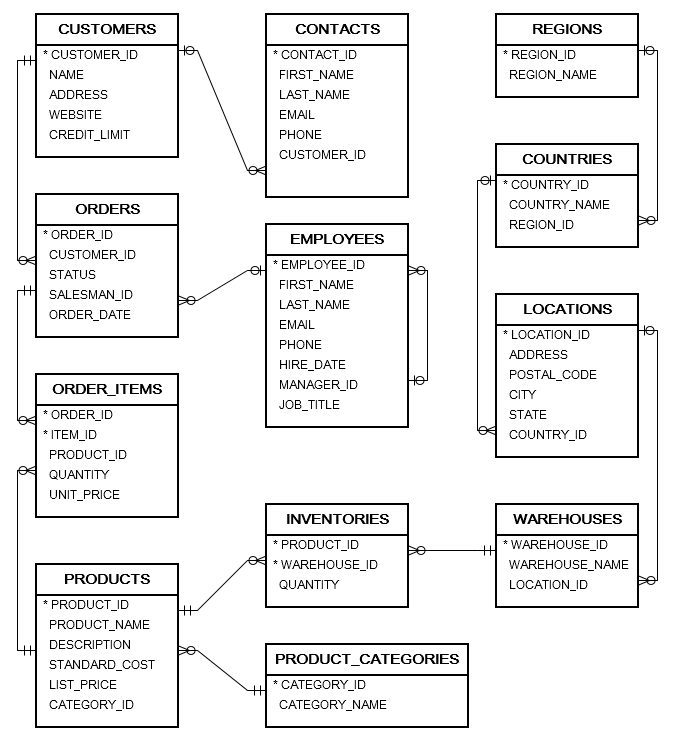

Everything should be made as simple as possible, but not simpler - Albert Einstein

DeTOnator is a set of projects based on an idea a colleague and I came up with about ten years ago. At that time we were generating
code for Spring, JdbcTemplate and JSF with only one set of validation rules propagated to UI and DAOs. There used to be FireStorm
DAO, but it was commercial and now it's a dead project from what I can tell. There are other products/projects like JOOQ out there
that do code generation, but typically you end up with one DAO per table. Even with generated code this will pollute your business
objects with unnecessary classes. DeTOnator uses a generic DAO interface and implementations. 
* [DeTOnator DTO](https://github.com/sgjava/detonator/tree/master/dto) generates Java DTOs, keys and SQL, but it could be use to
generate other artifact types and other languages.
* [DeTOnator Maven Plugin](https://github.com/sgjava/detonator/tree/master/detonator-maven-plugin) leverages DeTOnator DTO to add
high performance code generation to your Maven based projects.
* [DeTOnator DAO](https://github.com/sgjava/detonator/tree/master/dao) is a generic Java SE DAO layer.
* [DeTOnator Guice](https://github.com/sgjava/detonator/tree/master/guice) A Java SE based JTA is provided with
annotations, Narayana, Guice and AOP magic.
* [DeTOnator TomEE](https://github.com/sgjava/detonator/tree/master/tomee) Use DeTOnator DAO in a Jakarta EE project with transaction support.
* Based on OpenJDK 11 LTS.

* database.properties in the dto project is used by dao, guice and tomee modules. This way all modules are in sync with one database
implementation.
* app.properties is each project's test resources is used by each module to test specific properties. You can also override
database.properties to use the same test schema as the dto project.

The sample database from [Oracle](https://www.oracletutorial.com/getting-started/oracle-sample-database) has been modified and
cleaned up a bit. An H2 equivalent is also provided. While not the best structured database in the world it does provide something
for the tests to kick around.

